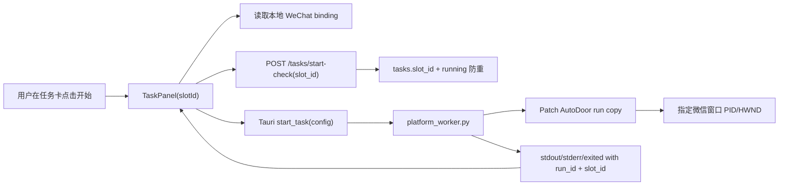

# FriendAuto 当前会话交接

更新时间：2026-06-30  
当前分支：`master`  
远程仓库：`git@github.com:zzw-0912/AddFriendAuto.git`  
本轮主题：多任务配置绑定独立微信窗口

最新补充：会员套餐价格调整为月卡 300 元、季卡 500 元、年卡 800 元；试用次数用完或会员过期后，桌面端会自动弹出充值窗口；管理后台订单金额和套餐价格按“元”展示，订单状态和支付方式展示为中文。

> 下次新会话优先读取本文件。历史文件 `SESSION_SUMMARY.md` 只作归档入口；若历史摘要和当前实现冲突，以本文件和代码为准。

## 1. 本轮需求

用户要实现月卡、季卡、年卡对应不同数量的任务配置，并且每个任务配置可以独立绑定一个微信窗口运行：

- 月卡解锁 1 个任务配置，对应 `微信1`。
- 季卡解锁 2 个任务配置，对应 `微信1`、`微信2`。
- 年卡解锁 3 个任务配置，对应 `微信1`、`微信2`、`微信3`。
- 多个任务可以同时运行。
- 每个任务配置必须只显示自己的日志、计数和退出事件。
- 启动任务时必须跑到手动绑定的微信窗口，避免总是命中第一个微信。

## 2. 关键决策

- 采用“手动绑定微信窗口”的方案，不自动拉起或登录微信。
- 微信窗口绑定 UI 放在 `desktop/src/ProfilePage.tsx` 的“我的”页；`SettingsPage.tsx` 仍为 legacy，不在当前导航里。
- slot 数量根据会员套餐判断：
  - 无会员、试用或 `plan_id = 1`：1 个 slot。
  - `plan_id = 2`：2 个 slot。
  - `plan_id = 3`：3 个 slot。
- 每个 slot 独立保存 `dailyLimit`、`createTag`、`greetingText` 到本地配置。
- 全局默认任务配置只作为新 slot 的初始化 fallback。
- 任务事件统一以 `run_id` 和 `slot_id` 归属，前端只处理当前任务卡对应事件。
- Tauri 不再维护单个 worker，而是用 `HashMap<run_id, Child>` 管理多个并发 worker。
- 后端通过 `slot_id` 记录任务来源，并阻止同一用户同一 slot 重复创建 running 任务。
- worker 在运行前 patch AutoDoor 树，把微信 StartNode 的 `window_pid/window_hwnd/window_title` 指向绑定窗口。

## 3. 已完成实现

### 桌面端任务卡

- `TaskCard/TaskPanel` 增加 `slotId`。
- 任务标题显示为 `微信1任务配置`、`微信2任务配置`、`微信3任务配置`。
- 根据会员套餐渲染 1/2/3 张任务卡。
- 每个任务卡独立持久化配置。
- 启动前读取对应 slot 的微信绑定。
- 如果未绑定或绑定窗口失效，前端直接显示明确错误，不启动后端任务。
- 启动任务时把 `slot_id` 和 `wechat_binding` 一起传给 Tauri worker。
- 停止任务时按当前 `run_id` 停止，不影响其他正在运行的 slot。
- `script-event` 处理时按 `slot_id/run_id` 过滤，避免日志和计数串台。

### “我的”页微信绑定

- 新增“微信窗口绑定”区域。
- 支持刷新当前已打开微信窗口。
- 支持给 `微信1/微信2/微信3` 分别选择窗口并绑定。
- 支持清除绑定。
- 本地保存绑定快照：`hwnd`、`pid`、`title`、`displayName`、`boundAt`。

### Tauri 多任务进程

- `TaskState` 从单个 `Child` 改为 `HashMap<String, Child>`。
- `start_task` 解析 `run_id/slot_id` 后，只替换同一 `run_id` 的旧 worker。
- `stop_task` 改为接收 `run_id` 并只停止指定 worker。
- stdout、stderr、exited 事件都会补齐 `run_id` 和 `slot_id`。
- 新增 `list_wechat_windows` 命令，通过 PowerShell 枚举已打开微信窗口。
- `list_wechat_windows` 已增强为 Win32 `EnumWindows` 顶层窗口枚举，不再只依赖 `Get-Process.MainWindowHandle`，可发现同一进程下的多个可见微信窗口。
- 新增 `validate_wechat_binding` 命令，启动前直接校验绑定 `HWND` 是否仍存在且 PID 匹配，避免窗口列表漏枚举时误判失效。

### 后端与迁移

- `/tasks/start-check` 增加 `slot_id`。
- `tasks` 表新增 `slot_id` 字段。
- 新增索引 `ix_tasks_user_slot_status`。
- 后台任务响应和管理后台任务列表包含 `slot_id`。
- `task_service.start_check` 会检查套餐 slot 权限。
- 同一用户同一 slot 已有 running 任务时，拒绝重复启动。
- `seed.py` 增加本地 SQLite 兼容补列逻辑，避免旧库缺少 `slot_id`。
- `seed.py` 会按套餐名称同步默认套餐价格：月卡 300 元、季卡 500 元、年卡 800 元，并会更新已有旧价格。
- `server/alembic/env.py` 调整为使用应用配置里的数据库 URL，确保迁移目标一致。

### Worker / AutoDoor

- `scripts/platform_worker.py` 接收 `slot_id` 和 `wechat_binding`。
- patch AutoDoor 树时为微信相关 StartNode 写入绑定窗口。
- 如果找不到可绑定的微信 StartNode，会报错退出。
- 保留之前的微信冷启动重试逻辑。
- 未绑定时仍会清理旧 StartNode 窗口句柄，保持原有单微信兼容行为。
- AutoDoor 后台消息输入 `bg` 已验证不适合当前微信链路，默认不启用；仅当环境变量 `FRIENDAUTO_FORCE_BG_INPUT=1` 时才会启用实验性后台输入。
- AutoDoor 文本输入节点已预留 FriendAuto 侧跨进程剪贴板锁，仅在实验性后台输入启用时生效。
- 为避免多个 worker 抢同一套物理鼠标键盘，worker 会在进入 AutoDoor 前获取 `%APPDATA%\FriendAuto\automation.lock` 全局自动化锁；拿不到锁的任务会等待并输出“等待其他微信任务释放鼠标键盘...”，获得锁后输出“已获得鼠标键盘控制权，开始执行”。

## 4. 重要文件修改记录

### 桌面前端

- `desktop/src/MainPage.tsx`：根据套餐计算 slot 数量并渲染任务卡。
- `desktop/src/TaskCard.tsx`：透传 `slotId`。
- `desktop/src/TaskPanel.tsx`：slot 独立配置、绑定校验、事件过滤、按 `run_id` 停止。
- `desktop/src/ProfilePage.tsx`：新增微信窗口绑定 UI。
- `desktop/src/localSettings.ts`：新增任务 slot 配置和微信绑定的 localStorage 封装。
- `desktop/src/types.ts`：新增微信窗口、绑定、slot 配置相关类型。
- `desktop/src/MainPage.css`：新增多任务卡和微信绑定区域样式。

### Tauri

- `desktop/src-tauri/src/lib.rs`：多 worker 管理、微信窗口枚举、绑定校验、事件补齐 `run_id/slot_id`。
- `desktop/src-tauri/src/lib.rs`：微信窗口枚举从 `Get-Process.MainWindowHandle` 增强为 Win32 顶层窗口枚举。
- `desktop/src-tauri/src/lib.rs`：微信绑定校验改为直接 `IsWindow + GetWindowThreadProcessId` 校验绑定快照。

### Worker

- `scripts/platform_worker.py`：读取绑定快照并 patch AutoDoor StartNode。
- `scripts/platform_worker.py`：实验性支持通过 `FRIENDAUTO_FORCE_BG_INPUT=1` 使用 AutoDoor 后台输入，并为该模式下的剪贴板粘贴增加跨进程锁。
- `scripts/platform_worker.py`：进入 AutoDoor 前增加全局 `automation.lock` 排队，保证同一时间只有一个 worker 控制物理鼠标键盘。

### 后端

- `server/app/models/task.py`：`Task.slot_id`。
- `server/app/schemas/task.py`：start-check 请求和任务响应增加 `slot_id`。
- `server/app/api/tasks.py`：传递 `slot_id`。
- `server/app/services/task_service.py`：套餐 slot 权限和同 slot running 防重。
- `server/app/services/task_service.py`：启动检查前会自动收尾同用户同 slot 超过 12 小时的 stale running 任务，避免异常退出后永久卡住。
- `server/app/services/status_service.py`：无有效会员时仍会返回最近会员记录的 `ends_at`，供前端判断“会员已过期”并触发充值弹窗。
- `server/app/seed.py`：套餐价格同步为月卡 300 元、季卡 500 元、年卡 800 元。
- `server/app/schemas/admin.py`、`server/app/services/admin_service.py`：后台任务展示 slot。
- `server/app/seed.py`：本地 SQLite 补列和索引兼容。
- `server/alembic/env.py`：迁移数据库 URL 修正。
- `server/alembic/versions/b4f2a8c9d103_add_task_slot_id.py`：新增任务 slot 迁移。

### 管理后台

- `admin/src/api.ts`：任务类型增加 `slot_id`。
- `admin/src/TasksPage.tsx`：任务列表展示 slot 来源。
- `admin/src/OrdersPage.tsx`：订单金额从分格式化为元展示，支付方式和订单状态展示中文。
- `admin/src/PlansPage.tsx`：套餐价格按元显示和编辑，保存时仍转换为后端 `price_cents`。

### 充值弹窗

- `desktop/src/MainPage.tsx`：当会员不活跃且试用次数为 0，或最近会员到期时间已过期时，自动打开充值弹窗。
- `desktop/src/PaymentModal.tsx`：自动充值场景下无可用试用资格时隐藏“跳过，开始试用”。

## 5. 架构思路



核心边界：

- 前端负责 slot UI、本地配置、窗口绑定和事件归属。
- Tauri 负责本机窗口枚举、绑定有效性校验和 worker 生命周期管理。
- 后端负责会员权限、任务记录和同 slot 运行态约束。
- worker 负责把绑定快照转换为 AutoDoor 可以识别的窗口目标。

## 6. 已执行验证

- `python -m py_compile scripts\platform_worker.py`
- `python -m compileall app`
- `npm run build` in `desktop`
- `npm run lint` in `desktop`
- `npm run build` in `admin`
- `cargo check` in `desktop/src-tauri`
- 本轮针对多窗口并发修复后已再次执行 `python -m py_compile scripts\platform_worker.py`
- 本轮修复 stale running 和恢复默认输入后已再次执行 `python -m py_compile scripts\platform_worker.py`
- 本轮修复 stale running 和恢复默认输入后已再次执行 `python -m compileall app` in `server`
- 本轮修复 stale running 和恢复默认输入后已确认本地 SQLite 无 remaining `running` 任务
- 本轮针对多窗口并发修复后已再次执行 `cargo check` in `desktop/src-tauri`
- 本轮实现全局自动化执行队列后已再次执行 `python -m py_compile scripts\platform_worker.py`
- 本轮调整价格和充值弹窗后已执行 `python -m compileall app` in `server`
- 本轮调整价格和充值弹窗后已执行 `npm run build` in `desktop`
- 本轮调整价格和充值弹窗后已执行 `npm run lint` in `desktop`
- 本轮调整管理后台订单/套餐展示后已执行 `npm run build` in `admin`
- 本轮已执行 `python -m app.seed`，本地 `server/friendauto.db` 中套餐价格已确认：
  - 月卡：30000 分
  - 季卡：50000 分
  - 年卡：80000 分
- 临时 SQLite 执行 `alembic upgrade head`
- 本地 `server/friendauto.db` 已确认存在：
  - `tasks.slot_id`
  - `ix_tasks_user_slot_status`

## 7. 仍需人工回归

- 月卡、季卡、年卡分别登录，确认任务卡数量为 1/2/3。
- 绑定微信1、微信2后同时启动两个任务，确认两个 worker 并行存在。
- 停止其中一个任务，确认另一个任务不受影响。
- 分别启动微信1、微信2、微信3任务，确认 AutoDoor 跑到对应微信窗口。
- 清除绑定或关闭已绑定微信窗口后启动，确认显示明确错误且不误跑任务。
- 同 PID 多微信窗口的“主窗口枚举/绑定”已增强，但后续同标题窗口（如 `添加朋友`、`申请添加朋友`）仍需人工实测确认是否会串到同一 PID 下的其他窗口。

## 8. 下次会话建议入口

1. `SESSION_STATE.md`
2. `PROJECT_CURRENT_STATE.md`
3. `desktop/src/MainPage.tsx`
4. `desktop/src/TaskPanel.tsx`
5. `desktop/src/ProfilePage.tsx`
6. `desktop/src-tauri/src/lib.rs`
7. `scripts/platform_worker.py`
8. `server/app/services/task_service.py`
9. `server/alembic/versions/b4f2a8c9d103_add_task_slot_id.py`

## 9. 常用检查命令

```powershell
cd D:\FriendAuto
python -m py_compile scripts\platform_worker.py

cd D:\FriendAuto\server
python -m compileall app

cd D:\FriendAuto\desktop
npm run build
npm run lint

cd D:\FriendAuto\desktop\src-tauri
cargo check

cd D:\FriendAuto\admin
npm run build
```
