# FriendAuto 业务流程闭环详细说明

> 文档基于当前仓库代码整理，适用范围为 `D:\FriendAuto` 中的现状实现。  
> 说明时间点：2026-06-30。

## 1. 什么叫“业务流程闭环”

业务流程闭环，不是单纯把功能做完，而是让一条业务链从“进入系统”到“完成服务”，再到“结果回流并驱动下一次动作”全部可追踪、可结算、可运营。

对 FriendAuto 来说，闭环的核心不是“成功启动一个自动化脚本”，而是：

1. 用户能进入系统并建立合法身份。
2. 用户能被约束在可管理的设备和权限范围内。
3. 用户的试用次数或会员权益能控制可用能力。
4. 用户在权益不足时会被引导去下单和支付。
5. 支付完成后权益会被真正开通或续期。
6. 任务执行过程会消耗目标数据、产出结果、回写系统。
7. 执行结果会反过来影响试用次数、任务状态、后台统计和后续运营动作。
8. 用户遇到问题后还能通过反馈和后台运营形成服务回路。

这就是当前项目里的“业务流程闭环”。

## 2. 当前闭环的总体结论

FriendAuto 当前已经形成了一个可运行的业务闭环，主链路为：

`注册/登录 -> 设备绑定 -> 获取试用/会员状态 -> 启动任务前校验 -> 领取目标数据 -> 自动化执行 -> 结果回写 -> 扣减试用或延续会员价值 -> 反馈/运营处理 -> 继续使用或再次充值`

其中：

- 用户入口已经闭环。
- 权益控制已经闭环。
- 订单到会员开通已经闭环。
- 任务执行到结果回写已经闭环。
- 后台审计和运营介入已经闭环。

但支付通道和目标数据投放，当前仍有一部分是“人工闭环”而不是“全自动闭环”。

## 3. 整体业务流转图

```mermaid
flowchart LR
  A["用户注册/登录"] --> B["账号建立 + 设备绑定"]
  B --> C["读取 /me/status"]
  C --> D{"有有效权益吗?"}
  D -- "有会员或仍有试用" --> E["启动任务前校验"]
  D -- "无权益" --> F["选择套餐并创建订单"]
  F --> G["人工微信收款/后台确认支付"]
  G --> H["开通或续期会员"]
  H --> E
  E --> I["领取 task_targets 目标数据"]
  I --> J["Tauri 启动 worker + AutoDoor 执行"]
  J --> K["success / failed / invalid 结果上报"]
  K --> L["写入 task_results / 更新 task_targets"]
  L --> M["扣减试用次数或保持会员不限次"]
  M --> N["任务结束 / 回收未完成目标"]
  N --> O["用户继续使用或提交反馈"]
  O --> P["后台查看订单/任务/反馈/审计日志"]
  P --> C
```

## 4. 参与角色与系统分工

| 角色/模块 | 主要职责 | 在闭环中的位置 |
| --- | --- | --- |
| 用户 | 注册、登录、绑定设备、选择套餐、启动任务、提交反馈 | 业务发起方 |
| 桌面端 `desktop` | 展示状态、弹出充值、配置任务、监听执行日志 | 用户交互层 |
| Tauri 层 `desktop/src-tauri` | 管理本机命令、校验微信窗口绑定、启动/停止 worker | 本机执行调度层 |
| Python worker `scripts/platform_worker.py` | 调用 AutoDoor、执行自动化、输出事件 | 自动化执行层 |
| 后端 `server/app` | 账号、设备、权益、订单、任务、结果、反馈、后台能力 | 规则和数据中心 |
| 管理后台 `admin` | 确认支付、处理设备、查看任务、查看反馈、写审计日志 | 运营与风控层 |

## 5. 核心业务对象

| 对象 | 对应表/模型 | 作用 |
| --- | --- | --- |
| 用户 | `users` / `User` | 系统中的主身份 |
| 设备 | `devices` / `Device` | 约束账号使用设备，记录绑定与最近活跃 |
| 试用额度 | `trial_quotas` / `TrialQuota` | 控制非会员试用次数，默认 20 次 |
| 套餐 | `plans` / `Plan` | 定义会员时长和价格 |
| 订单 | `orders` / `Order` | 记录用户购买行为和支付状态 |
| 会员 | `memberships` / `Membership` | 记录开通、续期、冻结、过期状态 |
| 任务 | `tasks` / `Task` | 记录一次自动化执行的主过程 |
| 目标池 | `task_targets` / `TaskTarget` | 存放待执行的手机号或微信号目标 |
| 任务结果 | `task_results` / `TaskResult` | 记录 success、failed、invalid 等执行结果 |
| 联系人 | `contacts` / `Contact` | 后台联系人检索与兼容历史结果归档 |
| 用户反馈 | `feedbacks` / `Feedback` | 承接问题、建议、截图 |
| 后台审计 | `admin_audit_logs` / `AdminAuditLog` | 记录关键运营动作 |

## 6. 分阶段详细说明

### 6.1 用户进入系统：注册、登录、找回密码

系统通过邮箱验证码和密码完成用户身份建立。

- `POST /auth/send-code` 发送验证码。
- 验证码 60 秒内不可重复申请。
- 验证码有效期为 10 分钟。
- `POST /auth/register` 注册时会同时创建用户、创建设备绑定、初始化试用额度。
- `POST /auth/login` 登录时会校验密码，并更新最近登录时间。
- `POST /auth/reset-password` 用验证码重置密码。
- `POST /auth/refresh` 用旧 token 换新 token。

这一步的闭环意义是：用户一旦进入系统，不是匿名状态，而是形成了可认证、可结算、可追踪的正式身份。

### 6.2 设备绑定：把使用权和机器绑定起来

FriendAuto 当前采用“一个账号只能绑定一台设备”的规则。

- 注册时会自动绑定当前 `machine_code`。
- 登录时也会校验设备绑定关系。
- 同一个账号如果已经绑定过其他设备，会被拒绝登录。
- 同一台设备可以绑定多个账号，这一点当前代码是允许的。
- 后台可执行设备更新、解绑、重新绑定到其他用户。

这一步的闭环意义是：把“账号”变成“可控账号”，防止权益脱离设备约束而无序扩散。

### 6.3 权益中心：试用和会员共同决定能否继续使用

桌面端会调用 `GET /me/status` 获取用户状态，后端统一返回：

- 会员是否有效。
- 当前套餐 `plan_id`。
- 会员开始和结束时间。
- 试用总次数、已用次数、剩余次数。

当前权益规则是：

- 新用户默认初始化 20 次试用额度。
- 会员有效期内，不扣试用次数。
- 非会员只有在结果为 `success` 时才会真正扣减试用次数。
- 如果会员已经过期，后端仍会返回最近一次会员结束时间，前端可据此判断“会员已过期”。

桌面端会在两种情况下主动弹出充值窗口：

1. 试用次数已经用完。
2. 用户曾经开通过会员，但会员已经到期。

这一步的闭环意义是：系统不会让用户“无限用到失控”，而是把可用状态、不可用状态和下一步付费动作连接起来。

### 6.4 套餐购买：从权益不足到下单支付

当前套餐来自 `GET /plans`，默认有三档：

| 套餐 | 时长 | 价格 |
| --- | --- | --- |
| 月卡 | 30 天 | 300 元 |
| 季卡 | 90 天 | 500 元 |
| 年卡 | 365 天 | 800 元 |

桌面端购买流程如下：

1. 用户在 `PaymentModal` 中选择套餐。
2. 前端调用 `POST /orders` 创建订单。
3. 订单创建时写入：
   - `order_no`
   - `user_id`
   - `plan_id`
   - `amount_cents`
   - `payment_channel`
   - `status = pending`
4. 当前主支付方式为 `manual_wechat`。
5. `QRCodeModal` 会展示客服二维码和订单信息，用户完成线下转账。

这一步的闭环意义是：系统已经能把“充值意愿”沉淀成正式订单，而不是停留在客服聊天层面。

### 6.5 支付确认：把订单真正变成会员权益

当前支付链路是人工确认闭环：

1. 用户在线下微信转账。
2. 管理员在后台执行 `POST /admin/orders/{order_id}/confirm-payment`。
3. 后端进入统一的 `process_order_payment` 落账逻辑。

支付确认后的规则如下：

- 对订单行加锁，防止并发重复处理。
- 如果订单已是 `paid`，直接返回“已处理”，保证幂等。
- 如果订单不是 `pending`，拒绝继续处理。
- 将订单状态更新为 `paid`，写入 `paid_at`。
- 如果用户当前已有有效会员，则新会员从旧会员的 `ends_at` 开始续期。
- 如果用户当前没有有效会员，则从当前时间开始开通。
- 系统会新建一条 `memberships` 记录，而不是直接覆盖历史记录。

这一步的闭环意义是：钱不只是“收到了”，而是被系统性地转换成了可消费的权益，并且可追溯。

### 6.6 任务卡与槽位：会员等级决定可用任务能力

当前项目已经把“会员价值”直接映射成“任务槽位数量”：

| 用户状态 | 可用任务槽位 |
| --- | --- |
| 非会员或试用用户 | 1 个 |
| 月卡 `plan_id = 1` | 1 个 |
| 季卡 `plan_id = 2` | 2 个 |
| 年卡 `plan_id = 3` | 3 个 |

桌面端会根据用户状态动态渲染 1、2、3 张任务卡。每个槽位都是独立任务配置，包括：

- `slot_id`
- `target_type`
- `daily_limit`
- `create_tag`
- `greeting_text`
- 绑定的微信窗口

这一步的闭环意义是：会员价值不是抽象的，而是直接体现在可用能力上。

### 6.7 任务启动前校验：先判断能不能做，再真的去执行

用户点击开始任务后，不会直接运行脚本，而是先做两层校验。

第一层是桌面端/本机校验：

- 当前网络是否在线。
- 当前槽位是否已绑定微信窗口。
- Tauri 是否验证通过该窗口绑定仍然有效。

第二层是服务端业务校验 `POST /tasks/start-check`：

- 目标类型是否有效，只允许 `phone` 或 `wechat_id`。
- 当前账号是否有活跃设备。
- 当前是否仍有试用额度，或者是否有有效会员。
- 当前会员等级是否允许启动该 `slot_id`。
- 同一个用户同一个槽位是否已有运行中的任务。
- 超过 12 小时的陈旧 `running` 任务会先被自动收尾。

校验通过后，后端会正式创建一条 `tasks` 记录，状态为 `running`。

这一步的闭环意义是：系统不会让不合法任务进入执行层，避免“前端看起来能点，后端其实已经失控”的情况。

### 6.8 领取目标数据：从目标池中分配本次任务

任务启动通过后，桌面端会调用 `POST /tasks/{task_id}/claim-targets` 领取任务数据。

领取规则如下：

- 数据来源于 `task_targets` 目标池。
- 只会领取当前用户自己的目标。
- 只会领取目标类型匹配的数据。
- 只会领取状态为 `pending` 的数据。
- 一次最多领取 `daily_limit` 条。
- 被领取的数据会变成 `claimed`，并记录 `claimed_task_id` 和 `claimed_at`。

如果当前没有可执行目标：

- 前端会提示“暂无可执行任务数据”。
- 当前任务会立即被收尾，避免产生空转任务。

这一步的闭环意义是：每次执行不是“凭空跑脚本”，而是和明确的数据资源绑定。

### 6.9 自动化执行：桌面端、Tauri、worker、AutoDoor 串起来

在用户确认本次目标预览后，桌面端会通过 Tauri 调用 `start_task` 启动本地 worker。

执行链条如下：

1. 前端把 `run_id`、`task_id`、`slot_id`、微信窗口绑定信息、目标列表等传给 Tauri。
2. Tauri 按 `run_id` 管理子进程，并把输出统一转成 `script-event` 事件。
3. worker 读取配置，复制 AutoDoor 运行副本。
4. worker 会把绑定的微信窗口信息 patch 到 AutoDoor 节点里。
5. worker 真正驱动微信窗口执行自动化流程。
6. 执行期间不断输出：
   - `started`
   - `progress`
   - `success`
   - `failed`
   - `invalid`
   - `finished`
   - `exited`

一个重要设计点是：

- 项目允许多任务槽位并存。
- 但物理鼠标键盘的控制权通过全局 `automation.lock` 串行化。

也就是说，业务层允许多槽位能力存在，但实际自动化操作会排队执行，避免多个 worker 抢同一套物理输入设备。

这一步的闭环意义是：任务不是只停留在后端记录里，而是真正进入本机执行，并且可被监听和控制。

### 6.10 结果回写：把执行行为沉淀成业务结果

桌面端会监听 Tauri 发出的 `script-event`，并把结果上报到：

- `POST /tasks/{task_id}/results`

结果回写规则如下：

- 至少要有 `target_id` 或 `contact_id` 之一。
- 如果同一任务下相同目标已经写过结果，会直接识别为重复结果。
- `TaskResult` 对 `(task_id, target_id)` 和 `(task_id, contact_id)` 建了唯一约束，进一步防重复入账。
- `success` 会把目标状态改成 `success`。
- `invalid` 会把目标状态改成 `invalid`。
- 其他失败类结果会把目标状态改成 `failed`。
- 每条结果都会保存 `message`，方便后台复盘。

这一步的闭环意义是：自动化行为不再是黑盒，而是转化成系统可统计、可扣减、可复盘的数据。

### 6.11 试用扣减：只有真正成功才消耗非会员额度

当前项目对试用额度的扣减非常明确：

- 只有 `event == success` 时才会考虑扣减试用。
- 即使成功，也要先判断用户是否存在有效会员。
- 有效会员不扣试用。
- 非会员且还有剩余额度时，才执行：
  - `used_count + 1`
  - `remaining_count - 1`
- 结果会在 `task_results.trial_charged` 中留下记号。

这一步的闭环意义是：系统能把“服务结果”准确结算到“权益消耗”，做到按结果收费而不是按点击收费。

### 6.12 任务结束与资源回收：避免任务和数据卡死

任务结束时，前端会调用：

- `POST /tasks/{task_id}/finish`

后端会执行：

- 把 `tasks.status` 改成 `finished`
- 写入 `finished_at`
- 释放本任务还处于 `claimed` 状态的目标

这里的释放逻辑非常关键：

- 如果一个目标被任务领取了，但最终没有正常完成，就会被恢复成 `pending`。
- 这样它可以被后续任务重新领取，不会永久卡死在某个中断任务里。

此外，系统还处理了异常场景：

- 同一槽位 `running` 超过 12 小时，会被视为陈旧任务并自动收尾。
- worker 退出后，前端也会主动触发收尾。

这一步的闭环意义是：系统不仅要能启动任务，也要能正确结束任务，并把占用的资源还回去。

### 6.13 用户反馈与后台运营：服务完成后还要能回流

业务闭环不能只到“任务跑完”，还要包含售后和运营回路。

当前用户反馈链路如下：

1. 用户在桌面端提交反馈。
2. 内容通过 `POST /feedback` 进入后端。
3. 图片会保存到 `uploads/feedback/<user_id>/`。
4. 后台通过 `GET /admin/feedback` 查看反馈内容和截图。

当前后台运营链路包括：

- 用户列表与用户详情查看
- 设备查看、修改、解绑、重新绑定
- 套餐查看与修改
- 订单查看与确认收款
- 任务列表与结果查看
- 联系人查询
- 反馈查看
- 审计日志查看

并且关键后台动作会写入 `admin_audit_logs`，例如：

- 确认支付
- 更新套餐
- 延长会员
- 冻结/解冻会员
- 解绑设备
- 重新绑定设备

这一步的闭环意义是：一线使用中产生的问题、订单、设备异常、任务结果，不会散落在聊天记录里，而是能回收到后台系统内。

## 7. 为什么说这是“闭环”而不是“几段孤立功能”

闭环成立的根本原因，是前一步的结果会决定后一步能不能继续，并且最终还能反过来影响下一轮使用。

具体体现在：

1. 注册成功后会立刻生成试用额度和设备绑定，用户可以马上进入使用阶段。
2. 使用前必须读取当前会员和试用状态，权益直接控制是否能启动任务。
3. 权益不足时，前端会自动引导用户进入充值流程。
4. 订单被确认后，会员状态会立即变化，进而影响任务卡数量和可用时长。
5. 任务结果会反向影响试用剩余次数。
6. 未完成的目标会被释放回目标池，保证后续流程还能继续。
7. 用户反馈、订单确认、任务结果、设备操作都能在后台被查看和追溯。

换句话说，FriendAuto 当前不是“用户买了会员，但任务系统不知道”；也不是“任务跑了，但权益不结算”；更不是“出了问题，只能靠口头沟通”。这些关键点已经被系统串起来了。

## 8. 当前仍然是“人工闭环”的部分

虽然主闭环已经成立，但目前仍有几处是半自动状态：

### 8.1 支付仍然以人工确认收款为主

当前主流程是：

- 用户创建订单
- 扫客服码转账
- 管理员后台确认收款

`/payments/wechat/callback` 和 `/payments/alipay/callback` 目前只是 debug mock，不是正式支付通道。

### 8.2 目标数据投放入口尚未形成完整前台闭环

系统内部已经有 `task_targets` 目标池和领取机制，但当前仓库里没有看到完整的用户自助导入、分配、清洗、回收页面流程。因此执行闭环已经存在，但“目标数据从哪里来”这一段还不够产品化。

### 8.3 反馈到工单/版本迭代还依赖人工处理

现在用户反馈可以进入系统并被后台查看，但还没有进一步自动流转成：

- 工单状态
- 负责人
- 处理时限
- 回访结果

所以这是“能回流，但还没完全流程化”的状态。

## 9. 当前闭环里的关键风控与一致性设计

项目里已经有不少保证闭环稳定性的机制：

| 机制 | 作用 |
| --- | --- |
| 验证码 60 秒限流 | 防刷验证码 |
| 账号单设备绑定 | 控制权益扩散 |
| 订单加锁与已支付幂等返回 | 防止重复开通会员 |
| 同用户同槽位禁止重复 `running` | 防止任务并发污染 |
| 12 小时陈旧任务自动收尾 | 防止任务永久卡死 |
| `task_results` 唯一约束 | 防止重复扣次和重复记结果 |
| 释放未完成 `claimed` 目标 | 防止目标池资源泄漏 |
| 微信窗口绑定校验 | 防止任务跑错窗口 |
| `automation.lock` | 防止多个 worker 抢物理鼠标键盘 |
| 后台审计日志 | 防止运营动作不可追溯 |

这些机制共同保证：闭环不仅“看起来完整”，而且在异常情况下也尽量能收得回来。

## 10. 代码模块对照

| 业务环节 | 主要代码位置 |
| --- | --- |
| 注册/登录/验证码 | `server/app/api/auth.py`、`server/app/services/auth_service.py` |
| 设备绑定 | `server/app/services/device_service.py` |
| 用户状态 | `server/app/api/status.py`、`server/app/services/status_service.py` |
| 套餐与订单 | `server/app/api/plans.py`、`server/app/api/orders.py`、`server/app/services/order_service.py` |
| 支付落账 | `server/app/services/payment_service.py` |
| 后台确认支付 | `server/app/api/admin.py`、`server/app/services/admin_service.py` |
| 任务启动与结果上报 | `server/app/api/tasks.py`、`server/app/services/task_service.py` |
| 桌面端任务交互 | `desktop/src/MainPage.tsx`、`desktop/src/TaskPanel.tsx`、`desktop/src/PaymentModal.tsx` |
| 本机调度 | `desktop/src-tauri/src/lib.rs` |
| 自动化执行 | `scripts/platform_worker.py` |
| 用户反馈 | `server/app/api/feedback.py`、`server/app/services/feedback_service.py` |
| 运营后台 | `admin/src/*` |

## 11. 一句话总结

FriendAuto 当前的业务闭环，本质上是“用权益驱动使用、用订单补充权益、用任务结果结算权益、用后台和反馈回收问题”的一套完整链路。

它已经不是单纯的自动化工具，而是一套具备账号管理、权益管理、支付落账、执行控制、结果归档、运营回流能力的业务系统。
